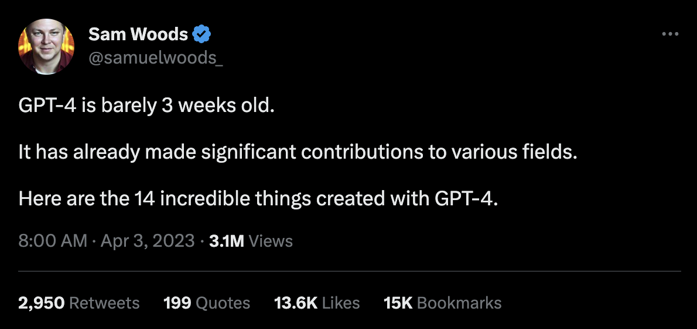
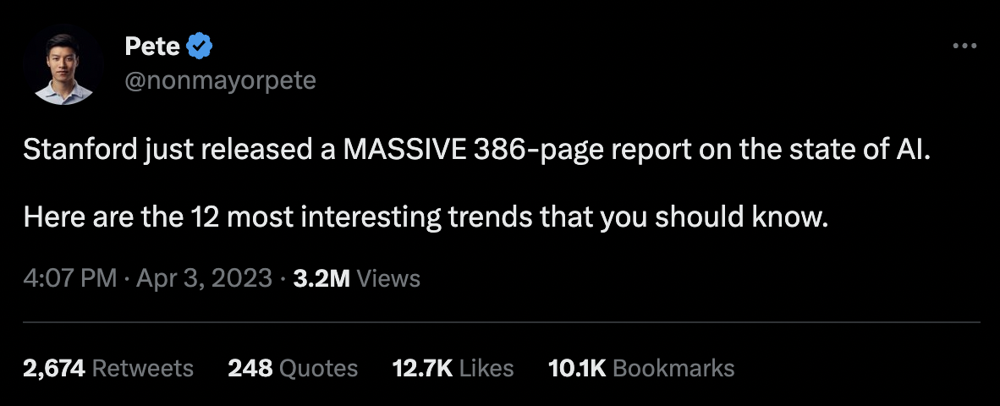
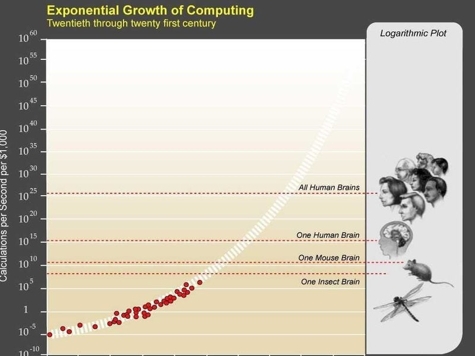
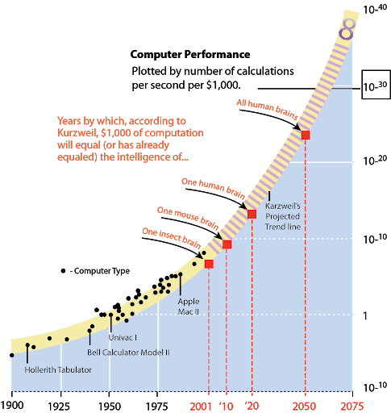

# ChatGPT
## the marriage of meaning with mechanism

---

## Parting thoughts

- like fire and electricity, both more profound and more mundane than expected
- part of the 4th industrial revolution--glue between technologies
- impossibly big possibilities and implications
    - lean in to the grounding that your philosophical, spiritual, religious tradition gives you
    - also, you are not alone if you feel some anxiety

---

## What is ChatGPT?

- Chat "Generative Pre-trained Transformer"
- [A large language model](https://confusedbit.dev/posts/how_does_gpt_work/)
- "A calculator, but for language"
- General Purpose Technology
  - as important as electricity, train, computer, internet, etc.

---

## What can it do?

Let's try a few things

---

## Examples

---

---
src: ./pages/examples.md
hide: false
---

## What can it do?

- Content creation
- Programming assistance
- Translation
- Data analysis & visualization
- Creative writing support
- And many more

---

## Limitations & Differences from Human Intelligence

- Complexity difference
- Ongoing learning
- Limited to words
- Limited input (no nonverbal cues)
- Behavioral limitations

---

## Security & Ethics

- All data shared with OpenAI
  - you are volunteering to make next version better
- Security breaches have already occurred between accounts
- OpenAI tunes the model for ethical responses
- Filters for dangerous or illegal interactions

---

## My Predictions for the Future

### Near-term

- Crossword puzzles are dead
- Bigger models with new emergent intelligence
- Impact on marketing and infotainment jobs
- Benefits for people with ADHD

### Mid-term

- Major disruption to economy (example: 70% job loss to video game artists)
- New education targets, e.g. prompt engineering
- An LLM (large language model) on your device for privacy, new wave of games & apps

### Long-term

- We will begin to see ourselves in a new way

---

## Co-working Spaces - Near Future

&nbsp;

### Enhanced collaboration tools
- AI-assisted project management and communication platforms
- Streamlined workflows and efficient resource allocation

### Customized AI services for startups
- Tailored AI solutions based on specific industry needs and goals
- Support for accelerated growth and innovation

### AI-driven community building
- Enhanced tenant experience through AI-powered recommendations and events
    - e.g. Match-making suggestions, etc.

---

## Mid-term

&nbsp;

### On-demand access to AI resources
- Co-working spaces offering AI-as-a-Service (AIaaS) for tenant startups?
- Seamless integration of AI tools with the co-working ecosystem
    - e.g. describe your needs and have a room booked for you, automatically
- Personalized tenant support, e.g. Q&A bot?

### Expansion of AI-focused educational programs and support
- Workshops, training sessions, and mentorship programs for AI integration
- Creation of a community of AI experts and professionals within co-working spaces

---

## Long-term

&nbsp;

### Co-working spaces as AI innovation hubs
- Attracting top AI talent and fostering collaborations among AI-driven startups

### AI-powered business models and services
- Emergence of new products & services tailored to AI-driven co-working environments

---

## Impacted Industries

- Customer Service
- Content Creation & Marketing
- Software Development
- Education & Training
- Translation & Localization
- Healthcare
- Legal Services
- Human Resources
- Finance
- Manufacturing & Supply Chain

---

---

---

## Parting thoughts

- like fire and electricity, both more profound and more mundane than expected
- part of the 4th industrial revolution--glue between technologies
- impossibly big possibilities and implications
    - lean in to the grounding that your philosophical, spiritual, religious tradition gives you
    - also, you are not alone if you feel some anxiety
